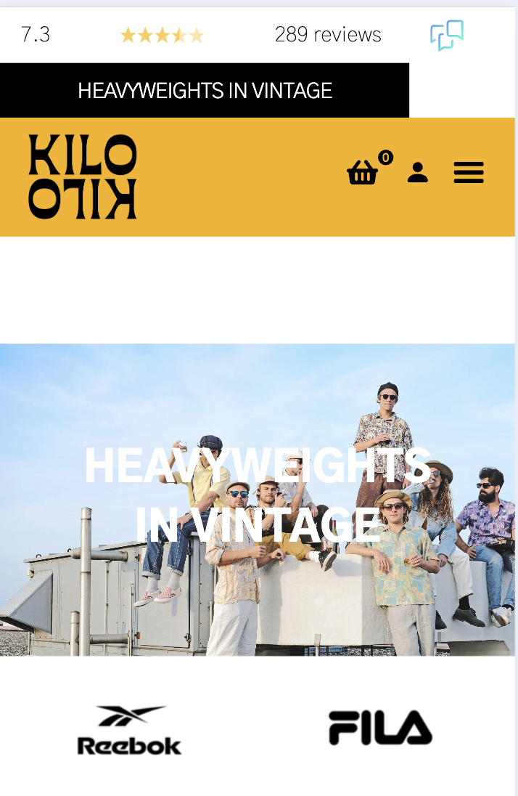

# Procesverslag
Markdown is een simpele manier om HTML te schrijven.  
Markdown cheat cheet: [Hulp bij het schrijven van Markdown](https://github.com/adam-p/markdown-here/wiki/Markdown-Cheatsheet).

Nb. De standaardstructuur en de spartaanse opmaak van de README.md zijn helemaal prima. Het gaat om de inhoud van je procesverslag. Besteedt de tijd voor pracht en praal aan je website.

Nb. Door *open* toe te voegen aan een *details* element kun je deze standaard open zetten. Fijn om dat steeds voor de relevante stuk(ken) te doen.

## Jij

  
uitwerken voor kick-off werkgroep

  ### Auteur:
  Lotte Ritmeester

  #### Je startniveau:
  Mijn start niveau is blauw, maar ik zou richting rood willen gaan.

  #### Je focus:
  Ik wil gaan focussen op de surface plane. 
 

## Je website

  
uitwerken voor kick-off werkgroep

  ### Je opdracht:
  https://www.kilokilovintage.nl 

  #### Screenshot(s) van de eerste pagina (small screen): 
  home pagina kilo kilo 
  

  #### Screenshot(s) van de tweede pagina (small screen):
  Ticket pagina Froukje.net  
  
 

## Toegankelijkheidstest 1/2 (week 1)

  
uitwerken na test in 2e werkgroep

  ### Bevindingen
  Lijst met je bevindingen die in de test naar voren kwamen:

  De webiste is niet super toegankelijk zo zijn er bijvoorbeeld geen alt omschrijvingen bij afbeeldingen. Ook maken ze niet helemaal logisch gebruik van h1, h2, h3 en h4 elementen. Het is niet helemaal in de juiste volgorde. Verder is de website over het algemeen best oke in elkaar gezet, er word natuurlijk wel heel veel gebruik gemaakt van div. 

  Hieronder foto's van de ingevulde toegankelijksheid test

## Breakdownschets (week 1)

  
uitwerken na afloop 3e werkgroep

  ### de hele pagina: 
  
   
    

  ### dynamisch deel (bijv menu): 
  

## Voortgang 1 (week 2)

  
uitwerken voor 1e voortgang

  ### Stand van zaken
  Ik was begonnen met het maken van de header, ik had eerste alleen de bovesnte zwarte balk en gele navigatie in de header gezet. Ik was op dat moment bezig met de tekst over de afbeelding te krijgen. Toen kreeg ik de tip van Danny om de afbeelding en tekst die daar overheen staat ook in de header te zetten. Ik heb dit toen gedaan en met wat hulp van studenasistent ali heb ik dit voor elkaar gekregen. Verder omdat het probleem met mijn header al opgelost was ging ik het gesprek in met niet heel veel vragen.

  ### Agenda voor meeting
  samen met je groepje opstellen

  | student 1      | student 2          | student 3    | student 4
  
  Mijn groepje had bij de eerste meeting niet heel veel vragen, aangezien ook niet iedereen er was. We wilden allemaal eigenlijk meer onze website even laten zien en kijken of de code goed is. Verder hebben we even wat hulp gekregen bij het uploaden van onze bestanden in github. 

  ### Verslag van meeting
  hier na afloop snel de uitkomsten van de meeting vastleggen

  - Upload je werk vaker op Github
  - Hou je Read me bij 
  - Zorg dat je code netjes ingesprongen staat

## Voortgang 2 (week 3)

  
uitwerken voor 2e voortgang

  ### Stand van zaken
  Hier was ik inmiddels al een heel eind met de basis van de website, ik moest nog wel iccontjes zoals pijltjes en in de nav bar een winkelmandje zetten.

  ### Agenda voor meeting
  samen met je groepje opstellen
  We hebben als groepje geen vragen vooraf besproken, we zijn naar de meeting gegaan en hebben daar ter plekken onze vragen gesteld. Iedereen had ook specifieke vragen waar andere op dat moment nog niet mee bezig waren of dat al wel hadden gedaan of niet hadden. Ik heb iets meer informatie gevraagd over of je een pijltje als code in je html kan plaasten of dat het een afbeelding moet zijn. Daarbij heb ik de tip gekregen om voor icoontjes een svg te gebruiken. 

  ### Verslag van meeting
  hier na afloop snel de uitkomsten van de meeting vastleggen

  - Svg gebruiken voor icoontjes 
  - met svg iconen kan je makkelijker light en dark mode maken 
  - maak gebruik van custom properties 
  - Als je bijv. een button stijlt doe dit dan op "a" en niet op 1 specifiek element 10x

## Toegankelijkheidstest 2/2 (week 4)

  
uitwerken na test in 9e werkgroep

  ### Bevindingen
  Ik heb nu opnieuw de test gedaan bij mijn eigen website. Wat mij vooral opviel is dat de website toegankelijker is. Dit komt eigenlijk vooral omdat ik bij elke afbeelding een alt tekst heb neergezet. Dit doet al heel veel voor het begrijpen van de website. Verder had het op sommige punten wel toeganelijker gekunt, meer gebruik maken van aria labels bijvoorbeeld, maar door de tijdsdruk had ik hier geen tijd voor. 

  hier onder de foto's van de toegankelijkheids test (zelfde foto's als bij de vorige)

## Voortgang 3 (week 4)

  
uitwerken voor 3e voortgang

  ### Stand van zaken
  Ik ben bijna klaar met de website ik moet nu vooral nog foccusen op de surface en dingen gaan toevoegen. Ik had hier alvast een goed begin mee gemaakt, zodat ik als ik nog ergens tegen aan liep ik vragen zou kunnen stellen tijdens dit laaste feedback moment. Ik was dan ook tegen een aantal dingen aangelopen waar ik vragen over had. Zoals mijn radio buttons zaten verstopt en mijn wischlist werkte niet helemaal zoals ik dat wilde. 

  ### Agenda voor meeting
  samen met je groepje opstellen

  | student 1      | student 2          | student 3    | student 4        |
 Opnieuw heb ik van te voren niet met mijn groepje besproken wat voor vragen we gingen stellen. Zelf heb ik zoals hierboven al beschreven vragen gesteld over mijn radio button, wishlist en navigatie. Hier heb ik via Danny later nog hulp bij kunnen krijgen

  ### Verslag van meeting
  hier na afloop snel de uitkomsten van de meeting vastleggen

  - bij je wishlist gebruik maken van for each 
  - label die display none heeft, specifiseren

## Eindgesprek (week 5)

  
uitwerken voor eindgesprek

  ### Je uitkomst - karakteristiek screenshots:
  
    

  ### Dit ging goed/Heb ik geleerd: 
  Wat ik goed vond gaan tijdens deze opdracht is dat ik verbaasd was over hoeveel ik eigenlijk al wist. Ik had verwacht dat alles veel meer weggezakt zou zijn en ik er meer moeite mee zou hebben. Ik was ook aardig gemotiveerd daardoor om mijn werk goed bij te houden. 

  Ik heb natuurlijk ook weer heel veel geleerd, zoals het maken van animaties, wat ik er leuk vond om te doen. Aangezien je relatief makkelijk iets kan laten bewegen. Ook heb ik fouten gemaakt waar een makkelijke oplossing voor is. Zoals Danny al tegen mij zei "dit vergeet je nooit meer". Ook heb ik geleerd wat custom properties zijn, wat ik eerst niet wilde gebruiken bleek achteraf toch best handig te zijn. 

  ### Dit was lastig/Is niet gelukt:
  Wat mij helaas eerst wel was gelukt, maar later niet meer werkte omdat ik nieuwe dingen heb toegoevoed is de witte balk bovenin. Ik had een witte balk bovenin gemaakt waarin je de beoordeling van de winkel zag staan. Eerst had ik hem samen met de rest van de navigatie op fixed gezet en toen bleef die in beeld staan. Maar de witte balk moest verdwijnen zodra je omlaag scrolde en de rest van de nav moest wel sticky zijn. Nu bleef de naviagtie maar een klein stukje staan en ging daarna terug naar boven. Ik kreeg dit niet meer optijd opgelost. 

  

  Verder heb ik overal natuurlijk gele buttons (links) gestyled. Dit ging overal eigenlijk goed behalve bij het kopje hand-picked vintage. De button is even breed al de pagina. Ali had mij hier mee geholpen en het was opgelost met het toevoegen van een margin, ik heb later alleen nog wat dingen veranderd en toegevoegd en nu krijg ik de button niet meer juist gestyled. Niet met padding, margin, gap. Ik heb dit geprobeerd op alle buttons toe te voegen, op het article en op het specifieke gedeelte zelf, helaas werkte dit allemaal niet. 

## Bronnenlijst

  
continu bijhouden terwijl je werkt

  Nb. Wees specifiek ('css-tricks' als bron is bijv. niet specifiek genoeg). 
  Nb. ChatGpT en andere AI horen er ook bij.
  Nb. Vermeld de bronnen ook in je code.

  1. bron: dlo opdracht: codepen states-kleurtjes met has en lightdark uitwerking
  2. Bron: Danny
  3. Brond: Ali (studentassistent)
  4.  https://www.a11yproject.com/posts/how-to-hide-content/
  5. https://chatgpt.com/c/66f59f6f-e034-8012-9cdc-fe5267bc7cd3
https://www.w3schools.com/howto/howto_js_popup_form.asp*
  6. bron dlo opdracht pen code js-3-stap- oefening 3-uitwerking wishlist
  7. brond: dlo opdrachten 

